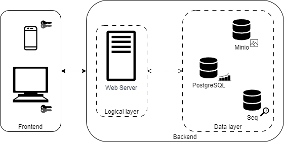

## Conception

### Architecture système

Nous sommes parti sur une architecture client-serveur afin de séparer le programme "frontend" du programme "backend".
Nous avons également décidé d'ajouter des services externes pour stocker les données (base de données PostgreSQL), les images (serveur Minio) et les logs (serveur Seq).

Chaque service externe représente un serveur à part, dont on a pas confiance. Par conséquence, les données qui y sont stockées y sont envoyées de manière chiffrées.

### Technologies

Le projet a été démarré au moyen d'une stack technologique appelée "T3 App". Celle-ci inclut:
- NextJS comme framework de gestion front et back ;
- TypeScript comme language de développement ;
- Prisma comme ORM ;
- tRPC comme gestionnaire d'appels web ;
- NextAuth.js comme gestionnaire d'authentification ;
- TailWind CSS comme framework CSS.

Nous employons également des services externes, comme mentionné plus tôt dans l'architecture système. Ces services sont:
- Minio pour le stockage de fichiers (dans notre cas des images) ;
- PostgreSQL pour le stockage de données (dans notre cas, l'ensemble des informations chiffrées par les clients, comme les noms d'images, d'albums, etc.) ;
- Seq pour le stockage et l'analyse des logs.

En plus de stocker l'historique d'activités dans Seq, nous les affichons également dans la console (côté serveur) et les stockons dans la base de données PostgreSQL avec un HMAC (pour en garantir l'intégrité).
À savoir que toute information envoyée à Seq n'est plus modifiable. Une fois que celui-ci a traité la donnée, il est impossible de la modifier, ou la supprimer individuellement.
