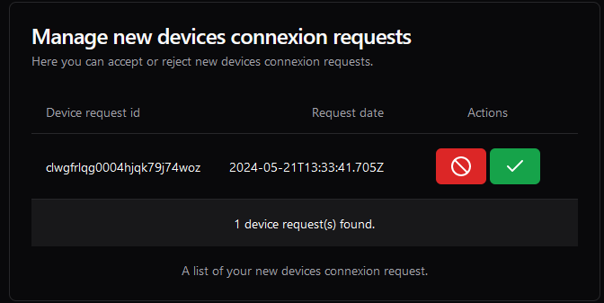
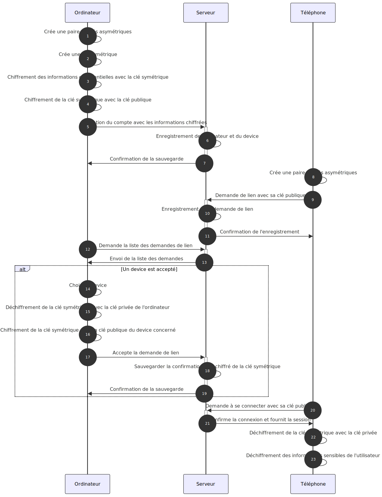
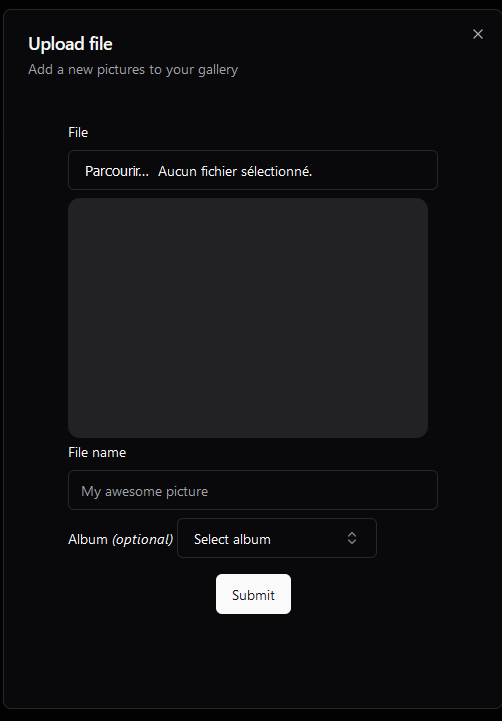
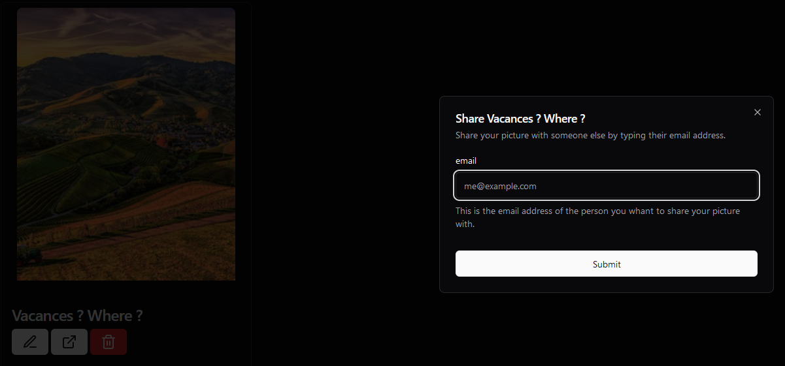
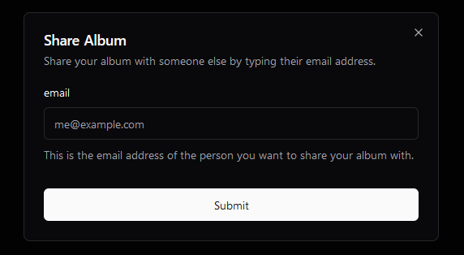
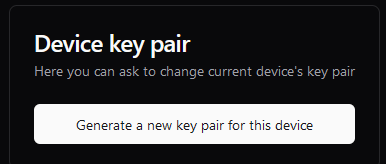
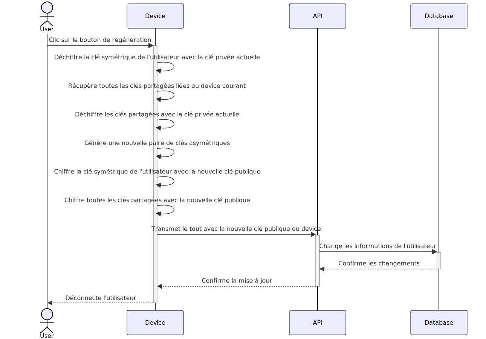
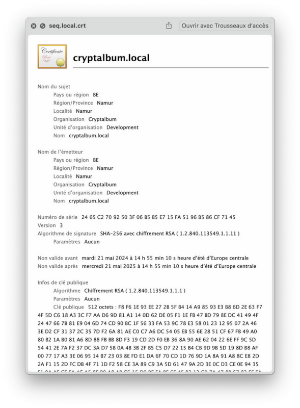

# Sécurité de bout en bout

La sécurité de bout en bout est assurée par un système de clés.

Nous avons utilisé le principe de clé symétrique chiffrée par clé publique pour le chiffrement des données utilisateur
sensibles. Le choix de cette clé symétrique est lié à la nécessité de partager les données sensibles de l'utilisateur
entre ses différents appareils.

Lors de son enregistrement, l'utilisateur génère une clé symétrique et une paire de clés asymétriques (publique et
privée). La clé symétrique est chiffrée avec la clé publique de l'appareil de l'utilisateur et stockée sur le serveur
en conjonction de la clé publique de celui-ci.

Il est important de noter que toute information qui quitte l'appareil de l'utilisateur est chiffrée afin d'être
enregistrée sur le serveur. Pour rappel, nous n'avons pas confiance en celui-ci.

## Chiffrement

Les données de l'utilisateur qui sont chiffrées sont :

- le nom de l'utilisateur ainsi que
- le nom de l'appareil.

Une fois les données chiffrées, la clé symétrique de l'utilisateur est chiffrée avec la clé publique de l'appareil.

## Choix des algorithmes

L'algorithme choisi pour la clé symétrique est `AES-GCM`.

Nous l'avons choisi car il s'agit du seul algorithme fourni par la librairie standard de JavaScript répondant toujours
aux standards de sécurité actuelle.

En ce qui concerne la clé asymétrique, nous avons utilisé l'algorithme `RSA_OAEP` avec un hash en `SHA-256`.
La taille de la clé est de **4096 bits**.

Il s'agit du seul algorithme fourni par la libraire JavaScript qui peut être encore utilisé de nos jours pour garantir
une bonne sécurité. C'est aussi le seul algorithme de la librairie qui permet de générer des clés de chiffrement et
déchiffrement. En effet, les autres algorithmes de la librairie ne permettent que de signer ou de vérifier une
signature.

## Ajout d'un autre appareil au compte

Lorsqu'un utilisateur souhaite ajouter un autre appareil à son compte, celui-ci peut envoyer une demande d'appairage à
l'autre appareil.

Pour se faire, l'utilisateur doit se rendre sur la page de demande d'appairage (Create a linking request).
Il est ensuite invité à entrer l'adresse email du compte auquel il souhaite appairer l'appareil.
Le propriétaire du compte reçoit cette demande depuis un de ses appareils certifiés et peut l'accepter ou la refuser.
Lors de l'acceptation, celui-ci peut donner un nom à cet appareil afin qu'il puisse le repérer plus facilement.

Après avoir donné un nom à son nouvel appareil, le processus d'échange de clés peut commencer.
La clé symétrique de l'utilisateur est déchiffrée avec la clé privée de l'appareil auquel il a déjà accès, et est
ensuite re-chiffrée avec la clé publique de l'appareil qui demande à rejoindre (sachant que celle-ci a été envoyée lors
de la demande d'appairage).

Finalement, les données sont enregistrées dans la base de données.
Cette dernière action clôture l'ajout d'un autre appareil à un même compte utilisateur.
À la fin de cette procédure, le nouvel appareil possède un accès aux mêmes données que l'appareil principal, en
déchiffrant la clé symétrique avec sa clé privée.

Voici un schéma représentant les différents échanges :

## Chiffrement d'une image

Lors de la création d'une image, une clé symétrique pour l'image est créée afin de chiffrer les informations sensibles
telles que :

- le nom, et
- l'image en elle-même.

Cette clé symétrique est ensuite chiffrée avec la clé publique de l'appareil, pour chaque appareil lié à l'utilisateur.
Le tout est sauvegardé comme clé de partage (`SharedKey`) dans la base de données.

## Chiffrement d'un album

Le processus de création d'un album est sensiblement le même que lors de la création d'une image.

En effet, lors de sa création, une clé symétrique est générée afin de chiffrer les informations de l'album telles que :

- son nom, et
- ses informations.

Cette clé est aussi utilisée pour chiffrer la clé symétrique des images qu'il contient, comme
expliqué [ci-après](#ajout-dune-image-dans-un-album).

## Ajout d'une image dans un album

Lorsque l'utilisateur souhaite ajouter une photo dans un album, le chiffrement de la photo est le même lors de son
upload vers le serveur.

Une fois la photo chiffrée avec sa clé symétrique, la clé de l'image est ensuite re-chiffrée avec la clé symétrique de
l'album. La clé symétrique de l'album est ensuite chiffrée avec la clé publique de chaque appareil.

Le résultat est un tableau de clés chiffrées qu'on ajoute comme clés partagées liées à l'image.

## Partage d'une image

Lorsqu'un utilisateur souhaite partager une image, on récupère l'adresse email du destinataire et on l'ajoute sur le
site web. Lorsque celle-ci est validée, tous les appareils liés au destinataire sont récupérés.

La clé symétrique de l'image est déchiffrée avec la clé privée de l'appareil de l'utilisateur, puis rechiffrée avec la
clé publique de chaque appareil du destinataire. Ainsi, chaque appareil du destinataire pourra déchiffrer la clé
symétrique de l'image avec sa clé privée et accéder à l'image.

Le résultat est un tableau de clés chiffrées qu'on ajoute comme clés partagées liées à l'image (colonne `sharedKeys`
dans le schéma de la base de données).

## Partage d'un album

Lorsqu'un utilisateur souhaite partager un album, on récupère l'adresse email du destinataire et on l'ajoute sur le site
web. Une fois l'adresse validée, on récupère tous les appareils liés au destinataire.

On va déchiffrer la clé symétrique de l'album avec la clé privée de l'appareil de l'utilisateur. Cette clé déchiffrée va
être rechiffrée avec la clé publique de chaque appareil du destinataire. Ainsi, chaque appareil du destinataire pourra
déchiffrer la clé symétrique de l'album avec sa clé privée et accéder à l'album.

Le résultat est un tableau de clés chiffrées qu'on ajoute comme clés partagées liée à l'album (colonne `sharedKeys` dans
le schéma de la base de données).

## Régénération des clés

Un utilisateur possède toujours la possibilité de régénérer ses clés asymétriques en cas de soucis avec la paire précédente. Pour se faire, celui-ci doit se rendre dans la section `profile` du site et doit cliquer sur le bouton :

Voici le processus :

1) on déchiffre la clé symétrique de l'utilisateur avec la clé privée actuelle,
2) on récupère toutes les clés partagées liées à l'appareil courant
3) on déchiffre les clés partagées avec la clé privée actuelle
4) on génère une nouvelle paire de clés asymétriques
5) on chiffre la clé symétrique de l'utilisateur et toutes les clés partagées avec la nouvelle clé publique
6) on transmet le tout à l'API, avec la nouvelle clé publique de l'appareil

Voici un diagramme de séquence qui explique son fonctionnement :

## Utilisation du reverse proxy Nginx pour TLS

Les clés sont générées avec cette commande :

`openssl req -x509 -nodes -days 365 -newkey rsa:4096 -keyout nginx/certs/SITE.key -out nginx/certs/SITE.crt -config nginx/certs/cryptalbum.conf &> /dev/null`.

Ces clés sont utilisées pour les sites suivants :

- seq.local
- minio.local
- cryptalbum.local

Les certificats sont en SHA-256 avec un chiffrement RSA à 4096 bits.

Voici un exemple de certificat :

