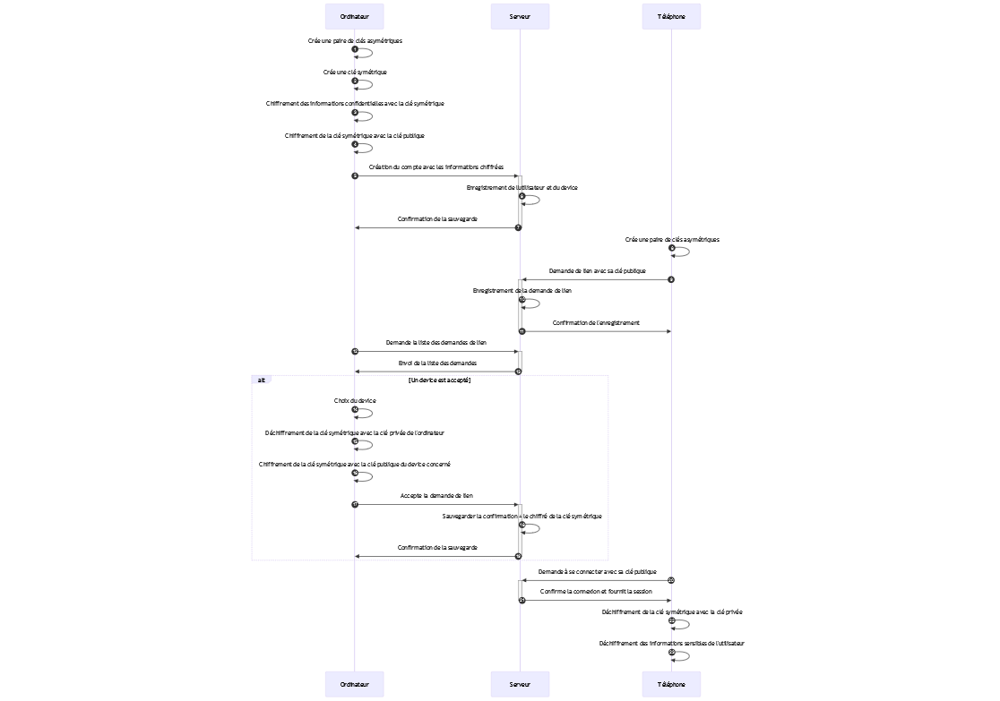

## Sécurité de bout en bout
La sécurité de bout en bout est assurée par un système de clés. Nous avons utilisé des clés symétriques lors de la création d'un compte utilisateur, ces clés sont partagées sur l'ensemble des appareils de l'utilisateur y compris sur les nouveaux appareils qu'il pourrait ajouter à son compte par après. Il est important de noter que toutes informations qui quittent l'appareil de l'utilisateur sont chiffrées afin d'être stockées sur le serveur. Pour rappel, nous n'avons pas confiance en celui-ci.

### Chiffrement
Les données de l'utilisateur qui sont chiffrées sont : le nom ainsi que le nom de l'appareil. Une fois les données chiffrées, la clé symétrique de l'utilisateur est chiffrée avec la clé publique de l'appareil.

### Choix des algorithmes
L'algorithme choisi pour la clé symétrique est AES-GCM. Nous l'avons choisi car il s'agit du seul algorithme fourni par la librairie standard de JavaScript et qui répond encore au standard de sécurité actuelle.

En ce qui concerne la clé asymétrique, nous avons utilisé l'algorithme RSA_OAEP avec un hash en SHA-256. La taille de la clé est de 4096 bits. Il s'agit du seul algorithme fourni par la libraire JavaScript qui peut être encore utilisé de nos jours.

### Ajout d'un autre appareil au compte
Lorsqu'un utilisateur souhaite ajouter un autre appareil à son compte, celui-ci peut envoyer une demande d'appairage à l'autre appareil. Pour se faire, l'utilisateur doit se rendre sur la page de demande d'appairage (Create a linking request), il est ensuite invité à entrer l'adresse email du compte auquel il souhaite appairer l'appareil. Le propriétaire du compte reçoit cette demande et peut l'accepter ou la refuser. Lors de l'acceptation, celui-ci peut donner un nom à cet appareil afin qu'il puisse le repérer plus facilement.

Lors de l'acceptation de l'appareil et après avoir donné un nom à son nouvel appareil, le processus d'échange de clés peut commencer. La clé symétrique de l'utilisateur est déchiffrée avec la clé privée de l'appareil auquel il a déjà accès. Cette clé est ensuite re chiffrée avec la clé publique de l'appareil qui demande à rejoindre (la clé publique a été envoyée lors de la demande d'appairage). Finalement, les données sont enregistrées dans la base de données.

Cette dernière action clôture l'ajout d'un autre appareil à un même compte utilisateur. L'autre appareil possède donc un accès aux mêmes données que l'appareil principal en déchirant la clé symétrique avec sa clé privée.

Voici un schéma représentant les différents échanges :

### Chiffrement d'une image

Lors de la création d'une image, une clé symétrique est créée afin de chiffrer les informations sensibles telles que le nom et l'image en elle-même. Cette clé symétrique est ensuite chiffrée avec la clé publique de l'appareil.

### Chiffrement d'un album
La création d'un album est sensiblement la même chose que lors de la création d'une image. En effet, lors de sa création, une clé symétrique est générée afin de chiffrer les informations de l'album telles que son nom et ses informations. Mais cette clé est aussi utilisée pour chiffrer la clé symétrique des images qu'il contient.

### Ajout d'une image dans un album

Lorsque l'utilisateur souhaite ajouter une photo dans un album, le chiffrement de la photo est le même lors de son upload vers le serveur. Une fois la photo chiffrée avec sa clé symétrique, la clé de l'image est ensuite re chiffrée avec la clé symétrique de l'album. La clé symétrique de l'album est ensuite chiffrée avec la clé publique de chaque appareil.

### Partage d'une image
Lorsqu'un utilisateur souhaite partager une image, on récupère l'adresse email du destinataire et on l'ajoute sur le site web. Quand l'adresse est validée, on récupère tous les appareils liés au destinataire. Pour chacune des clés publiques des appareils, on va déchiffrer la clé symétrique de l'image avec la clé privée de l'appareil. Cette clé déchiffrée va être chiffrée avec la clé publique de tous les appareils du destinataire. Le résultat est un tableau de clé chiffrée qu'on ajoute à la colonne sharedkeys liée à l'image.

### Partage d'un album
Lorsqu'un utilisateur souhaite partager un album, on récupère l'adresse email du destinataire et on l'ajoute sur le site web. Quand l'adresse est validée, on récupère tous les appareils liés au destinataire. Pour chacune des clés publiques des appareils, on va déchiffrer la clé symétrique de l'album avec la clé privée de l'appareil. Cette clé déchiffrée va être chiffrée avec la clé publique de tous les appareils du destinataire. Le résultat est un tableau de clé chiffrée qu'on ajoute à la colonne sharedkeys liée à l'album.